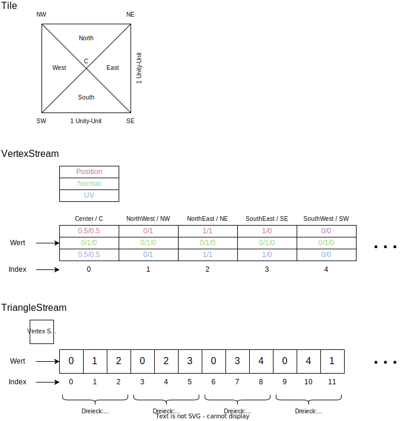

Bei der Implementierung des Terrains orientieren wir uns an der Umsetzung des Spiels "Parkitect".
Es handelt sich um ein "typisches" Low Poly "Tycoon Style"-Terrain.

Das Terrain selbst besteht aus mehreren Chunks.
Ein Chunk besteht aus mehreren Tiles.
Jedes Tile besteht aus 4 Dreiecken.

